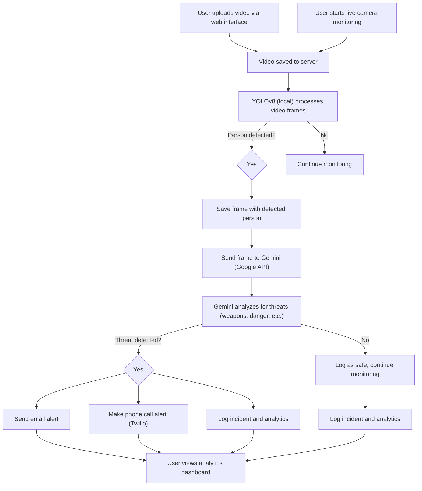

# 🦅 HawkEye

**HawkEye** is a real-time threat monitoring system that detects dangerous human activity from CCTV footage. Built with Flask, YOLOv8, and Google Gemini Vision, it automatically analyzes human movement in video files and sends email and phone alerts when suspicious behavior is detected.

---

## 📌 About the Project

HawkEye focuses primarily on **backend technology** — combining real-time object detection, contextual AI analysis, and intelligent alerting — to build a meaningful safety solution. While a basic frontend dashboard is included for demonstration purposes, the **core innovation lies in the detection and analysis pipeline**.

---

## 💡 Key Features

* 📂 Uses **YOLOv8** to detect humans and movements in CCTV-like footage (runs locally)
* 🎥 **Live camera monitoring** with real-time threat detection
* 🤖 Uses **Google Gemini Vision** to analyze screenshots for dangerous behavior (cloud API)
* ✉️ Sends detailed email alerts with images and structured threat logs
* 📞 Makes automated phone calls for critical threats (Twilio)
* 🔒 Supports **privacy masking** and **multi-level threat detection**
* 🧍‍♂️ **Tracks people** across multiple frames for consistency
* 📈 Provides **advanced analytics** and visual logs
* 📢 Supports **external alarm system triggers**
* 📁 Stores logs and reports for post-event investigation
* ⚙️ Backend-driven — minimal dependencies and frontend bloat

---

## 📽 Intended Use

HawkEye is designed to run locally on systems such as:

* Schools
* Retail environments
* Residential security systems
* **Live monitoring scenarios** (using built-in or external cameras)

It currently processes local video files and **live camera feeds**, and requires internet for AI-based analysis, but future versions will support **offline AI models** for complete local operation.

---

## 🧪 How It Works

### Video File Monitoring
1. Select a video file (placed in `/static/videos/`)
2. Optionally enable email alerts
3. Click **Start Monitoring**
4. The system processes the video file for threats

### Live Camera Monitoring
1. Go to the **Live Camera Monitoring** section
2. Select your camera from the dropdown
3. Optionally enable email alerts and privacy blur
4. Click **Start Live Monitoring**
5. The system monitors your camera feed in real-time

### Detection Process
The system:
* Detects human movement and extracts frames (YOLOv8, local)
* Applies AI for scene interpretation and threat assessment (Gemini Vision, cloud)
* Sends email and phone alerts for threats (if enabled)
* Logs activity with timestamps, labels, and screenshots

Logs are accessible at:
* `/logs`: General activity logs
* `/logs/action-required`: Only critical or high-risk events

---

## 🗺️ System Workflow Diagram

Below is a flowchart illustrating the end-to-end workflow of HawkEye, from video input to threat detection and alerting:



---

## 🧰 Technical Overview

* **Backend**: Python (Flask)
* **Frontend**: HTML/CSS/JavaScript (lightweight dashboard)
* **Detection**: Computer vision with YOLOv8 (local)
* **AI Analysis**: Gemini Vision via Google Generative AI API (cloud)
* **Tracking**: Person ID consistency across frames
* **Data Handling**: Structured logs and visual evidence
* **Connectivity**: External alarm integration (configurable)

---

## 🚧 Future Improvements

* Optimize detector for more efficient frame sampling
* Reduce false positives with custom ML models
* Integrate **real-time CCTV stream monitoring**
* Build **mobile app** for remote alerts and control
* Implement **user accounts** and **role-based access control**
* Support **fully offline AI models** for private deployments

---

## 🧱 Project Structure

```
HawkEye/
├── app.py              # Flask routes and control logic
├── detector.py         # Movement + frame capture + alert trigger
├── processor.py        # Google Gemini Vision analysis
├── call_service.py     # Phone call alert system (Twilio + Gemini)
├── emailer.py          # Email alert system
├── templates/
│   ├── index.html      # Demo UI for hackathon
│   └── analytics.html  # Threat analytics dashboard
├── static/
│   ├── saves/          # Captured screenshots + logs
│   ├── videos/         # Uploaded video files
│   ├── style.css       # Custom CSS styles
│   └── script.js       # JavaScript for UI interactions
├── .env                # Environment variables
```

---

## 🛠 Setup Instructions

### 1. Clone and set up virtualenv

```bash
git clone https://github.com/souma9830/HawkEye.git
cd HawkEye
python -m venv venv
source venv/bin/activate  # Windows: .\venv\Scripts\activate
```

### 2. Install dependencies

```bash
pip install -r requirements.txt
```

### 3. Create `.env` file

```env
GEMINI_API_KEY=your-gemini-api-key
SMTP_SERVER=smtp.gmail.com
SMTP_PORT=587
SMTP_USER=your-email@gmail.com
SMTP_PASSWORD=your-app-password
TWILIO_ACCOUNT_SID=your-twilio-sid
TWILIO_AUTH_TOKEN=your-twilio-auth-token
TWILIO_PHONE_NUMBER=your-twilio-phone
ALERT_PHONE_NUMBER=recipient-phone
```

### 4. Run the app

```bash
python app.py
```

Then open:  
`http://localhost:8080`

---

## 🧪 Testing Live Camera Functionality

Before using live camera monitoring, you can test if your camera is accessible:

```bash
python test_live_camera.py
```

This script will:
* Test camera access for multiple camera indices (0-4)
* Verify that the detector can work with live camera input
* Provide feedback on camera availability and functionality

**Note**: Make sure your camera is connected and not being used by other applications.

---

## 📃 License

Apache License 2.0

---

## 👏 Credits

- YOLOv8 by [Ultralytics](https://github.com/ultralytics/ultralytics)
- Gemini Vision by [Google](https://ai.google.dev/)
- Twilio for phone call alerts 